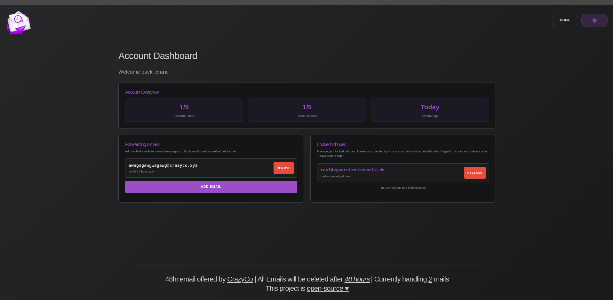
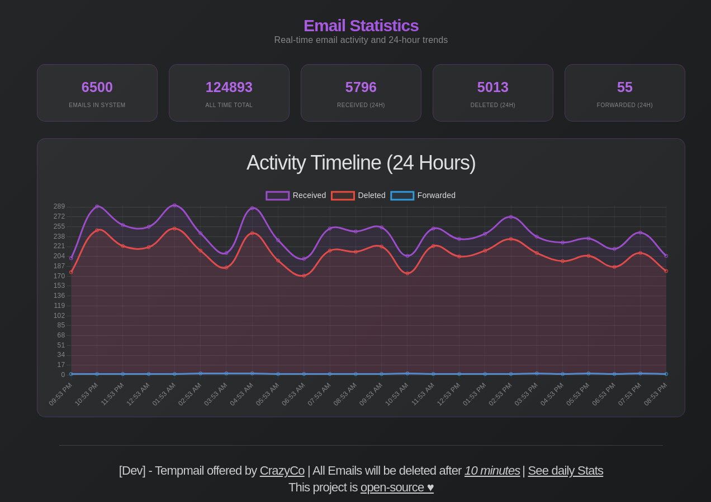
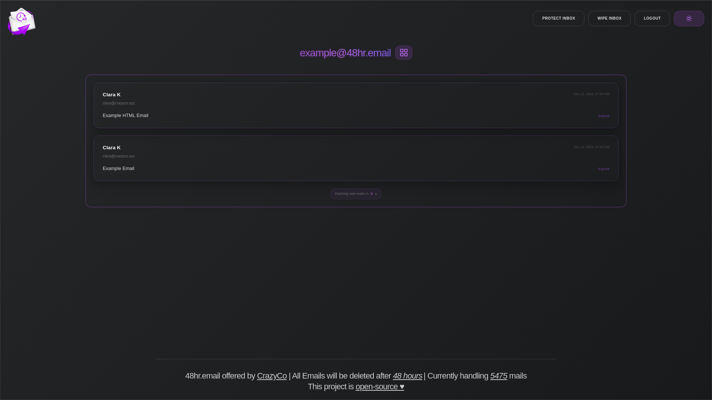
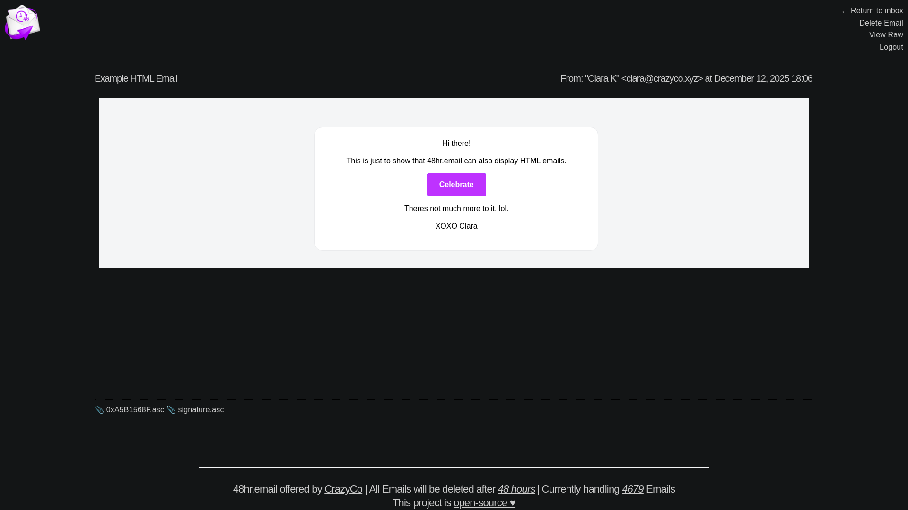
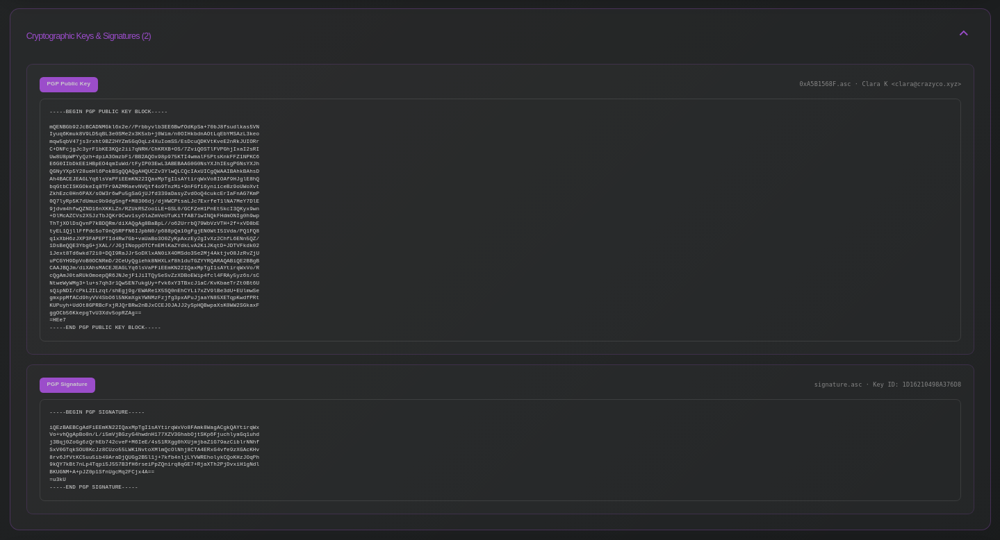

# 48hr.email

<p align="center">
    
</p>

<p align="center">
  <a href="https://48hr.email" target="_blank">Official Instance</a> •
  <a href="https://48hr.email/inbox/example@48hr.email" target="_blank">Example Inbox</a> •
  <a href="https://discord.gg/crazyco" target="_blank">Discord</a>
</p>

<br>

-----

## What is this?

48hr.email is my very own tempmail service. You can create emails on the fly with one click, not needing to worry about corporations do with your email. They can sell that one all they want!

All data is being removed 48hrs after they have reached the mail server.

<br>

-----

## Features

- **Custom or Random Inboxes** - Choose your own address or get one instantly
- **Real-time Updates** - Live email reception with Socket.IO and browser notifications
- **Full Email Rendering** - HTML, CSS, JavaScript support with attachment downloads
- **Raw Email View** - Inspect headers, MIME structure, and source
- **Cryptographic Key Detection** - Automatic PGP key and signature display
- **QR Code Generation** - Easy mobile access to your inbox
- **Dark/Light Theme** - Fully responsive design with theme toggle
- **Optional User Accounts** - Email forwarding and inbox locking (requires SMTP)
- **Optional Statistics** - Real-time metrics, historical analysis, and predictive charts
- **Highly Configurable** - Customize purge time, domains, branding, features, and limits via `.env`

<br>

-----

## Screenshots

| Homepage | Account Panel | Stats Page |
|:---:|:---:|:---:|
|  |  |  |

| Inbox | Email using HTML and CSS | Attachments and Cryptographic Keys view |
|:---:|:---:|:---:|
|  |  |  |


<br>

-----

## How does this work?

48hr.email uses an existing IMAP server for its handling. A single catch-all account and the accompanying credentials handle all the emails.

<br>

-----

## How can I set this up myself?

**Prerequisites:**
- Mail server with IMAP (Optionally also SMTP for registration and protected features)
- One or multiple domains dedicated to this
- git & nodejs

<br>

<details>
<summary>Option 1 - bare-metal install</summary>

#### Setup:
```bash
git clone https://github.com/Crazyco-xyz/48hr.email.git
cd 48hr.email
npm i
```

Change all settings to the desired values:
- Either use environmental variables, or modify `.env` (see `.env.example`)

```bash
npm run start
```

#### Service file example:
```ini
[Unit]
Description=48hr-email
After=network-online.target

[Service]
Type=exec
User=user
Group=user

WorkingDirectory=/opt/48hr-email
ExecStart=npm run start

Restart=on-failure
TimeoutStartSec=0
RestartSec=5s

[Install]
WantedBy=multi-user.target
```
</details>

<details>
<summary>Option 2 - Docker</summary>

#### Setup:
```bash
git clone https://github.com/Crazyco-xyz/48hr.email.git
cd 48hr.email
```

Change all settings to the desired values:
- Either use environmental variables, or modify `.env`, see `.env.example`

```bash
docker compose up -d
```

If desired, you can also move the config file somewhere else (change volume mount accordingly)
</details>

<br>

-----

## Support me

If you find this project useful, consider supporting its development!

<!--
Pwease support me >.<
-->  

<p>Since I work full-time on open-source projects spread across my organizations, my only source of income is donations from people like you that use & appreciate my stuff. So, if you can spare a dollar or two, I would really appreciate that. All the money goes towards paying rent, essentials like food, drinks etc, and most importantly it will be used to fuel my cookie addiction🍪<br></p>

**Crypto:**
- **XMR**: `42xc4qPZyfi4wzAkCBXSoMSo3BLDS8946J89JXDqtT5gRj6uYpfhjQF12NLPMxtqGDL2RxoWXjB73iYdBP8DX7SqGvdbdtb`<br>
- **USDT (TRX20):** `TWg6VDUBase3HDA6RxAwTVjQw4SbxoGyqZ`<br>
- **USDT (ERC20):** `0x841251438A8Fb2B16298C15B10feA9Fd2cEA3405`<br>
- **Doge:** `DCKAFtgw6686uEMaFzZfCtUajS9VjPJLMm`<br>
- **BTC:** `bc1qje8qy7gpudm8hhyx43n9xndg7d8xj5f7dh6m4p`<br>

**Fiat:**
- **[Patreon](https://patreon.com/crazyco) (Fee: 8%\*)**: ❤️ Account needed, subscription with perks
- **[ko-fi](https://ko-fi.com/crazyco) (Fee: 2%\*)**: No account needed, subscription or one-time donation
- **[Wire-transfer](https://bunq.me/ClaraK) (Fee: 0%\*)**: No account needed, one-time donation
- **[Paypal](https://paypal.me/ClaraCrazy)\*\* (Fee: 2%\*)**: Account needed, one-time donation

\* Fee is calculated by how much I will lose when cashing out<br>
\*\* Please make sure to select *Friends and Family*<br><br>
**Thanks for all your support <3**

