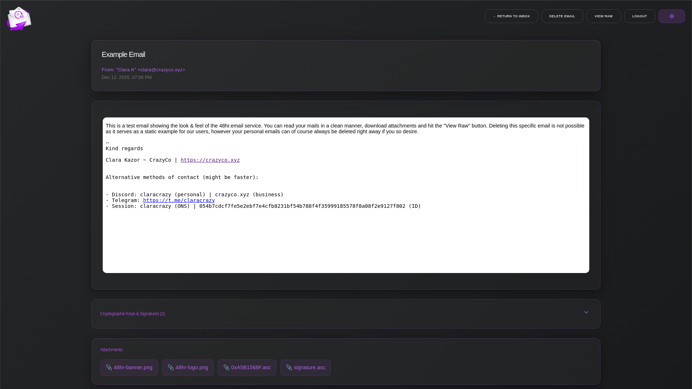

# 48hr.email

<p align="center">
    
</p>

-----

### What is this?

48hr.email is my very own tempmail service. You can create emails on the fly with one click, not needing to worry about corporations do with your email. They can sell that one all they want!

All data is being removed 48hrs after they have reached the mail server.

<p align="center"><a href="https://48hr.email" target="_blank">Try now</a> | <a href="https://48hr.email/inbox/example@48hr.email" target="_blank">Example Inbox</a> | <a href="https://discord.gg/crazyco" target="_blank">Discord</a></p>
<br><br>

-----

### What are its features?

- Create a custom inbox with select name and domain, or get a fully randomized one
- Receive emails with a clean preview in your inbox, with optional browser notifications
- Read emails, with support for HTML, CSS & JS just like you are used to from regular email providers
- Delete your emails ahead of time by pressing the delete button
- View the raw email, showing all the headers etc.
- Download Attachments
- and more...

<br><br>

-----

### How does this work?

48hr.email uses an existing IMAP server for its handling. A single catch-all account and the accompanying credentials handle all the emails.

<br><br>

-----

### How can I set this up myself?

- Prerequisites:
    - Mail server with IMAP
    - One or multiple domains dedicated to this
    - git & nodejs

<br>

<details>
<summary>Option 1 - bare-metal install:</summary>

- #### Setup:
    - `git clone https://github.com/Crazyco-xyz/48hr.email.git`
    - `cd 48hr.email`
    - `npm i`
    - Change all settings to the desired values:
        - Either use environmental variables, or modify `.env` (see `.env.example`)
    - `npm run start`

- #### Service file example:
```bash
[Unit]
Description=48hr-email
After=network-online.target

[Service]
Type=exec
User=user
Group=user

WorkingDirectory=/opt/48hr-email
ExecStart=npm run start

Restart=on-failure
TimeoutStartSec=0
RestartSec=5s

[Install]
WantedBy=multi-user.target
```
</details>

<details>
<summary>Option 2 - Docker:</summary>

- #### Setup:
    - `git clone https://github.com/Crazyco-xyz/48hr.email.git`
    - `cd 48hr.email`
    - Change all settings to the desired values:
        - Either use environmental variables, or modify `.env`, see `.env.example`
    - `docker compose up -d`
    - If desired, you can also move the config file somewhere else (change volume mount accordingly)
</details>

<br><br>

-----
### TODO (PRs welcome):
- Add user registration:
    - Optional "premium" domains that arent visible to the public to prevent them from being scraped and flagged
    - Allow people to set up forwarding 

#### Unsure:
- Possible payment integration once registration exists, to lock one or more of these new features behind a paywall (configurable, ofc)

<br><br>

-----

### Screenshots:

- #### Inbox:


- #### Email using HTML and CSS:


- #### Email without CSS:


<br><br>

-----

## ❤️ Support me

<!--
Pwease support me >.<
-->  

<p>Since I work full-time on open-source projects spread across my organizations, my only source of income is donations from people like you that use & appreciate my stuff. So, if you can spare a dollar or two, I would really appreciate that. All the money goes towards paying rent, essentials like food, drinks etc, and most importantly it will be used to fuel my cookie addiction🍪<br></p>

**Crypto:**
- **XMR**: `42xc4qPZyfi4wzAkCBXSoMSo3BLDS8946J89JXDqtT5gRj6uYpfhjQF12NLPMxtqGDL2RxoWXjB73iYdBP8DX7SqGvdbdtb`<br>
- **USDT (TRX20):** `TWg6VDUBase3HDA6RxAwTVjQw4SbxoGyqZ`<br>
- **USDT (ERC20):** `0x841251438A8Fb2B16298C15B10feA9Fd2cEA3405`<br>
- **Doge:** `DCKAFtgw6686uEMaFzZfCtUajS9VjPJLMm`<br>
- **BTC:** `bc1qje8qy7gpudm8hhyx43n9xndg7d8xj5f7dh6m4p`<br>

**Fiat:**
- **[Patreon](https://patreon.com/crazyco) (Fee: 8%\*)**: ❤️ Account needed, subscription with perks
- **[ko-fi](https://ko-fi.com/crazyco) (Fee: 2%\*)**: No account needed, subscription or one-time donation
- **[Wire-transfer](https://bunq.me/ClaraK) (Fee: 0%\*)**: No account needed, one-time donation
- **[Paypal](https://paypal.me/ClaraCrazy)\*\* (Fee: 2%\*)**: Account needed, one-time donation

\* Fee is calculated by how much I will lose when cashing out<br>
\*\* Please make sure to select *Friends and Family*<br><br>
**Thanks for all your support <3**

